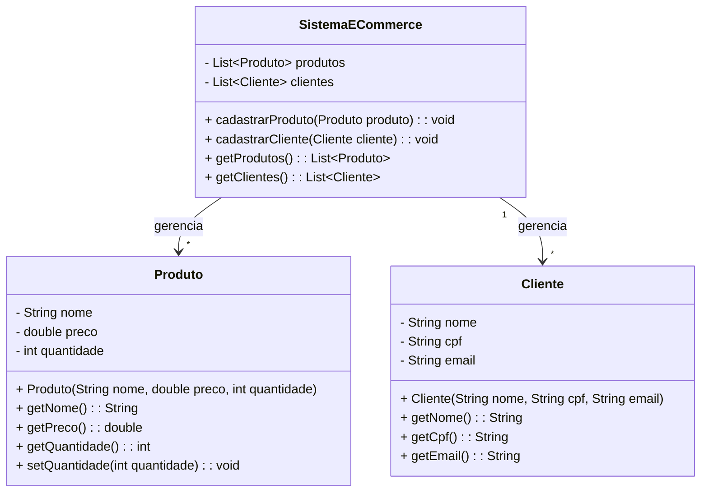

# Zup Ecommerce
Sistema de E-Commerce desenvolvido para simular o funcionamento de uma loja virtual, com foco em cadastro de produtos, clientes e compras.

## Diagrama de Classes:

```mermaid
classDiagram
class Produto {
  - String nome
  - double preco
  - int quantidade
  + Produto(String nome, double preco, int quantidade)
  + getNome(): String
  + getPreco(): double
  + getQuantidade(): int
  + setQuantidade(int quantidade): void
}

class Cliente {
  - String nome
  - String cpf
  - String email
  + Cliente(String nome, String cpf, String email)
  + getNome(): String
  + getCpf(): String
  + getEmail(): String
}

class SistemaECommerce {
  - List~Produto~ produtos
  - List~Cliente~ clientes
  + cadastrarProduto(Produto produto): void
  + cadastrarCliente(Cliente cliente): void
  + getProdutos(): List~Produto~
  + getClientes(): List~Cliente~
}

SistemaECommerce "1" --> "*" Produto : gerencia
SistemaECommerce "1" --> "*" Cliente : gerencia
```
