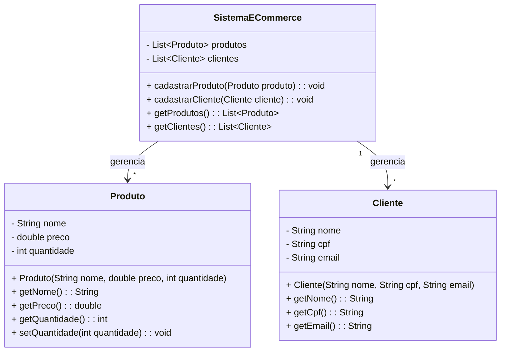

# Zup Ecommerce
Este é um projeto de exemplo de uma aplicação de e-commerce desenvolvida em Java utilizando o framework Spring Boot. A aplicação permite o gerenciamento de clientes e produtos, incluindo operações de criação, consulta e validação de dados.

## Tecnologias Utilizadas

1. Java 17
2. Spring Boot 3.x
3. Spring Data JPA
4. H2 Database (banco de dados em memória para testes)
5. Jakarta Persistence API (JPA)
6. Maven (gerenciador de dependências)

## Funcionalidades
### Clientes
1. Criar Cliente: Adiciona um novo cliente ao sistema.
2. Consultar Cliente por ID: Retorna os detalhes de um cliente específico.
3. Listar Todos os Clientes: Retorna uma lista de todos os clientes cadastrados.
### Produtos
1. Criar Produto: Adiciona um novo produto ao sistema.
2. Consultar Produto por ID: Retorna os detalhes de um produto específico.
3. Listar Todos os Produtos: Retorna uma lista de todos os produtos cadastrados.
### Validações
1. Validação de CPF (formato e duplicidade).
2. Validação de e-mail (formato).
3. Validação de campos obrigatórios.
4. Validação de valores positivos para preço e quantidade de produtos.
### Tratamento de Exceções
1. ClientNotFoundException: Lançada quando um cliente não é encontrado.
2. ProductNotFoundException: Lançada quando um produto não é encontrado.
3. IllegalArgumentException: Lançada para validações de dados inválidos.

## Diagrama de Classes:


## Estrutura do Projeto

```
src/main/java/com/zup/ecommerce 
├── controllers 
│ ├── ClientController.java 
│ └── ProductController.java 
├── exceptions 
│ ├── ClientNotFoundException.java 
│ ├── ProductNotFoundException.java 
│ └── GlobalExceptionHandler.java 
├── models 
│ ├── Client.java 
│ └── Product.java 
├── repositories 
│ ├── ClientRepository.java 
│ └── ProductRepository.java 
├── services 
│ ├── ClientService.java 
│ ├── ClientServiceImp.java 
│ ├── ProductService.java 
│ └── ProductServiceImpl.java 
├── utils 
│ └── ValidationUtils.java 
└── ZupEcommerceApplication.java
```
## Endpoints da API
### Clientes
```
| Método |     Endpoint     |          Descrição         |    Status HTTP de Sucesso     |
|--------|------------------|----------------------------|-------------------------------|
|POST    | /api/client      | Cria um novo cliente       | 201 (Created)                 |
|GET     | /api/client/{id} | Retorna um cliente pelo ID | 200 (OK)                      |
|GET     | /api/client      | Retorna todos os clientes  | 200 (OK)                      |
```
### Produtos
```
|Método |      Endpoint     |          Descrição         | Status HTTP de Sucesso |
|-------|-------------------|----------------------------|------------------------|
|POST   | /api/product      | Cria um novo produto       | 201 (Created)          |
|GET    | /api/product/{id} | Retorna um produto pelo ID | 200 (OK)               |
|DELETE | /api/product/{id} | Deleta um produto pelo ID  | 200 (OK)               |
|GET    | /api/product      | Retorna todos os produtos  | 200 (OK)               |
```

## Como Executar o Projeto
### Pré-requisitos:

1. Java 17 ou superior instalado.
2. Maven instalado.

### Clone o repositório:

```
git clone https://github.com/seu-usuario/zup-ecommerce.git
cd zup-ecommerce
```
### Execute o projeto:
```
mvn spring-boot:run
```

### Acesse a aplicação:
A API estará disponível em: http://localhost:8080
### Banco de Dados
A aplicação utiliza o banco de dados em memória H2 para facilitar o desenvolvimento e testes. Para acessar o console do H2:

1. URL: http://localhost:8080/h2-console
2. JDBC URL: jdbc:h2:mem:testdb
3. Usuário: sa
4. Senha: (deixe em branco)

### Testes
A aplicação inclui validações e tratamento de erros para garantir a consistência dos dados. Para testar os endpoints, você pode usar ferramentas como Postman, Insomnia ou cURL.

Exemplo de Requisição para Criar um Cliente

```
POST /api/client
Content-Type: application/json

{
"name": "João Silva",
"cpf": "12345678901",
"email": "joao.silva@example.com"
}
```

Exemplo de Requisição para Criar um Produto
```
POST /api/product
Content-Type: application/json

{
"name": "Notebook",
"price": 3500.00,
"amount": 10
}
```
### Melhorias Futuras
- Realização de Compras.
- Identificação do cliente pelo CPF.
- Registro das compras no sistema (atualização da quantidade de produtos).
### Contribuição
Contribuições são bem-vindas! Sinta-se à vontade para abrir issues ou enviar pull requests.
### Licença
Este projeto é licenciado sob a licença MIT. Consulte o arquivo LICENSE para mais informações.
### Desenvolvido com ☕ e Java.


