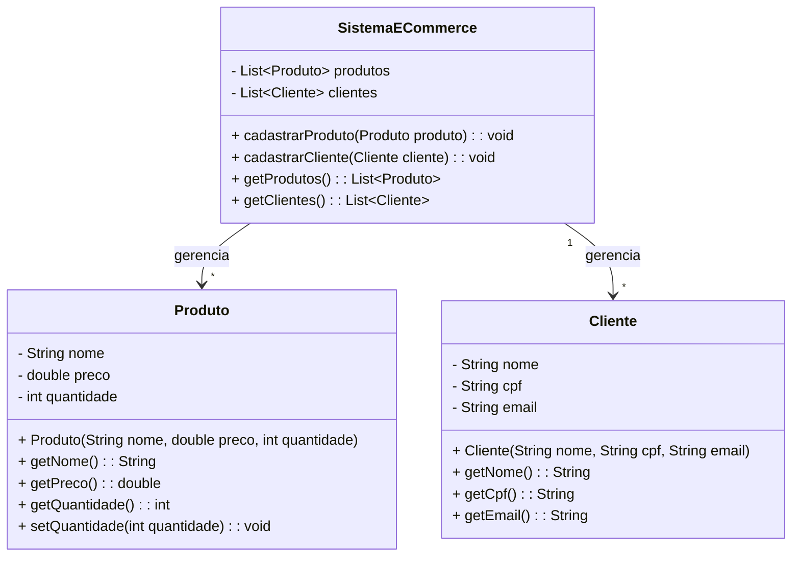

# 🛒 E-Commerce API
Este é um projeto de exemplo de uma aplicação de e-commerce desenvolvida em Java utilizando o framework Spring Boot. A aplicação permite o gerenciamento de clientes e produtos, incluindo operações de criação, consulta e validação de dados.

## Tecnologias Utilizadas

1. ☕ Java 17
2. 🌱 Spring Boot 3.x
3. 🗄️ Hibernate/JPA (para persistência de dados)
4. 🛢️ H2 Database (banco de dados em memória para desenvolvimento e testes)
5. 📦 Maven (gerenciador de dependências)
6. ✅ Jakarta Validation (para validações de dados)

## ✨ Funcionalidades
### 1. 🛍️ Cadastro de Produtos
Permite cadastrar produtos com as seguintes características:

**Nome:** Deve ser único.

**Preço:** Deve ser maior que 0.

**Quantidade:** Deve ser maior ou igual a 0.

### **Validações:**

❌ Não é permitido cadastrar produtos com o mesmo nome.

❌ O preço deve ser maior que 0.

❌ A quantidade não pode ser negativa.
### 2. 👤 Cadastro de Clientes
Permite cadastrar clientes com as seguintes características:

**Nome:** Não pode ser vazio.

**CPF:** Deve ser único e válido.

**Email:** Deve ser único e válido.

### **Validações:**

❌ Não é permitido cadastrar clientes com o mesmo CPF ou email.

❌ O CPF deve ser válido.

❌ O email deve ser válido.
### 3. 🛒 Realização de Compras
   Permite que um cliente realize compras enviando um JSON no seguinte formato:

```declarative
{
  "cpf": "12345678900",
  "produtos": [
    { "nome": "Produto1" },
    { "nome": "Produto2" }
  ]
}
```

## Funcionalidades:
🔍 Identifica o cliente pelo CPF.

✅ Valida se os produtos estão disponíveis em estoque.

🔄 Atualiza a quantidade de produtos no estoque.

💰 Calcula o total da compra.

📝 Registra a compra no sistema.
### Regras:
❌ Não é permitido comprar produtos com quantidade 0.

❌ Caso algum produto esteja em falta, a compra é cancelada e o sistema retorna uma mensagem de erro listando todos os produtos indisponíveis.


## Diagrama de Classes:


## Estrutura do Projeto

```
src/
├── main/
│   ├── java/com/zup/ecommerce/
│   │   ├── controllers/           # Controladores REST
│   │   ├── dtos/                  # Data Transfer Objects
│   │   ├── exceptions/            # Exceções personalizadas
│   │   ├── models/                # Entidades do banco de dados
│   │   ├── repositories/          # Interfaces de repositórios
│   │   ├── services/              # Interfaces e implementações de serviços
│   │   ├── utils/                 # Classes utilitárias
│   ├── resources/
│   ├── application.properties     # Configurações do Spring Boot
```
## 📋 Endpoints da API
## 1. 🛍️ Produtos
### Cadastrar Produto
***POST /api/product***

**Body:**
```json
{
  "name": "Produto1",
  "price": 10.50,
  "amount": 5
}
```
### Respostas:
- ✅ 201 Created: Produto cadastrado com sucesso.
- ❌ 400 Bad Request: Erro de validação (ex.: nome duplicado, preço inválido).

### Listar Todos os Produtos
**GET /api/product**
### Respostas:
- ✅ 200 OK: Retorna a lista de produtos.
### Buscar Produto por ID
**GET /api/product/{id}**
### Respostas:
- ✅ 200 OK: Retorna o produto.
- ❌ 404 Not Found: Produto não encontrado.
### Deletar Produto
**DELETE /api/product/{id}**
#### Respostas:
- ✅ 204 No Content: Produto deletado com sucesso.
- ❌ 404 Not Found: Produto não encontrado.
## 2. 👤 Clientes
### Cadastrar Cliente
**POST /api/client**

**Body:**
```json
{
  "name": "João Silva",
  "cpf": "12345678900",
  "email": "joao.silva@email.com"
}
```
#### Respostas:
- ✅ 201 Created: Cliente cadastrado com sucesso.
- ❌ 400 Bad Request: Erro de validação (ex.: CPF ou email duplicado).
### Listar Todos os Clientes
**GET /api/client**
#### Respostas:
- ✅ 200 OK: Retorna a lista de clientes.
### Buscar Cliente por ID
**GET /api/client/{id}**
#### Respostas:
- ✅ 200 OK: Retorna o cliente.
- ❌ 404 Not Found: Cliente não encontrado.

## 3. 🛒 Compras
### Realizar Compra
**POST /api/purchase**

**Body:**
```json
{
  "cpf": "12345678900",
  "produtos": [
    { "nome": "Produto1" },
    { "nome": "Produto2" }
  ]
}
```
#### Respostas:
- ✅ 201 Created: Compra realizada com sucesso.
- ❌ 400 Bad Request: Produto(s) em falta ou cliente não encontrado.
### Listar Todas as Compras
**GET /api/purchase**
#### Respostas:
- ✅ 200 OK: Retorna a lista de compras.
### Buscar Compra por ID
**GET /api/purchase/{id}**
#### Respostas:
- ✅ 200 OK: Retorna a compra.
- ❌ 404 Not Found: Compra não encontrada.

## ⚠️ Validações e Tratamento de Erros
## Validações
### Produtos:
- **Nome** não pode ser vazio ou duplicado.
- **Preço** deve ser maior que 0.
- **Quantidade** não pode ser negativa.
### Clientes:
- **Nome** não pode ser vazio.
- **CPF** deve ser válido e único.
- **Email** deve ser válido e único.
### Compras:
- **CPF** deve existir no sistema.
- **Produtos** devem existir e estar disponíveis em estoque.
### Tratamento de Erros
**O sistema retorna mensagens de erro padronizadas no seguinte formato:**
```json
{
"error": "Mensagem de erro descritiva"
}
```
## Exemplos:
- ❌ 400 Bad Request: Erros de validação ou produtos em falta.
- ❌ 404 Not Found: Cliente, produto ou compra não encontrados.
- ❌ 500 Internal Server Error: Erros inesperados.
## 🚀 Como Executar o Projeto
### Pré-requisitos:

1. ☕ Java 17 ou superior instalado.
2. 📦 Maven instalado.

### Clone o repositório:

```
git clone https://github.com/seu-usuario/zup-ecommerce.git
cd zup-ecommerce
```
### Execute o projeto:
```
mvn spring-boot:run
```

### Acesse a aplicação:
🌐 A API estará disponível em: http://localhost:8080
## 🗄️ Banco de Dados
A aplicação utiliza o banco de dados em memória H2 para facilitar o desenvolvimento e testes.

### 📋 Acessando o Console do H2

1. 🌐 URL: http://localhost:8080/h2-console
2. 🛠️ JDBC URL: jdbc:h2:mem:testdb
3. 👤 Usuário: sa
4. 🔑 Senha: (deixe em branco)
    
💡 Dica: Certifique-se de que a aplicação está em execução para acessar o console.

## 🌟 Melhorias Futuras
- 🔒 Adicionar autenticação e autorização.
- 🛢️ Migrar para um banco de dados relacional como MySQL ou PostgreSQL para produção.
## Contribuição
Contribuições são bem-vindas! Sinta-se à vontade para abrir issues ou enviar pull requests.
## Desenvolvido com ☕ , ❤️ e Java.


