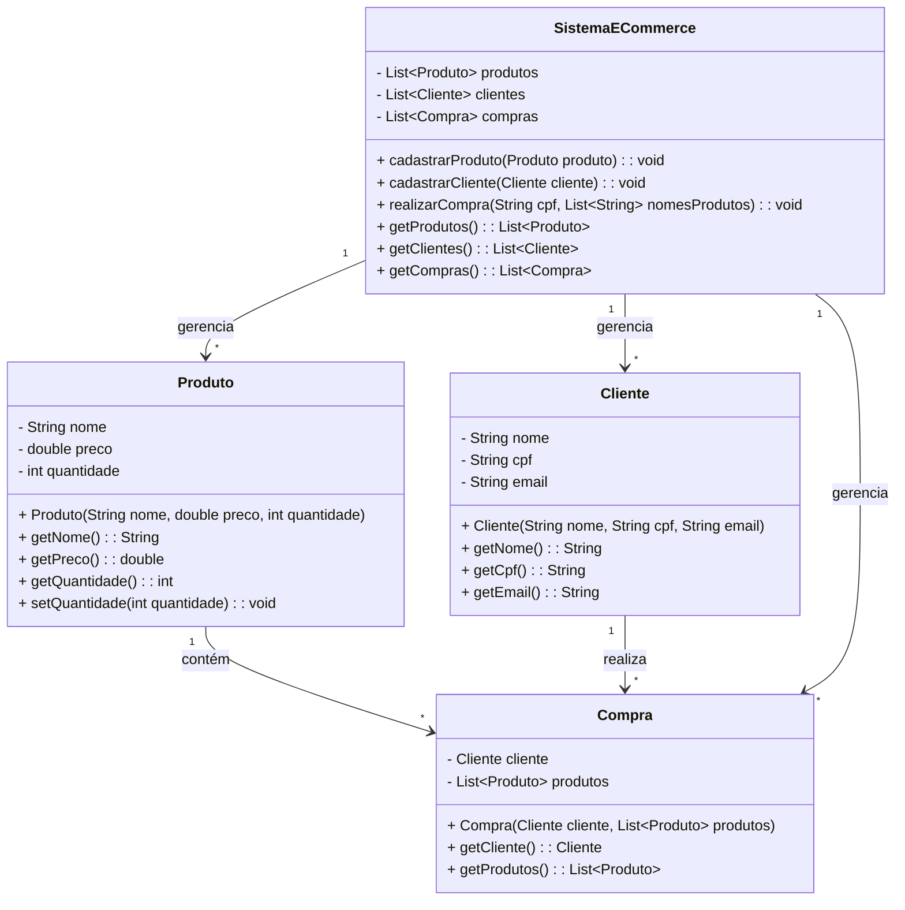
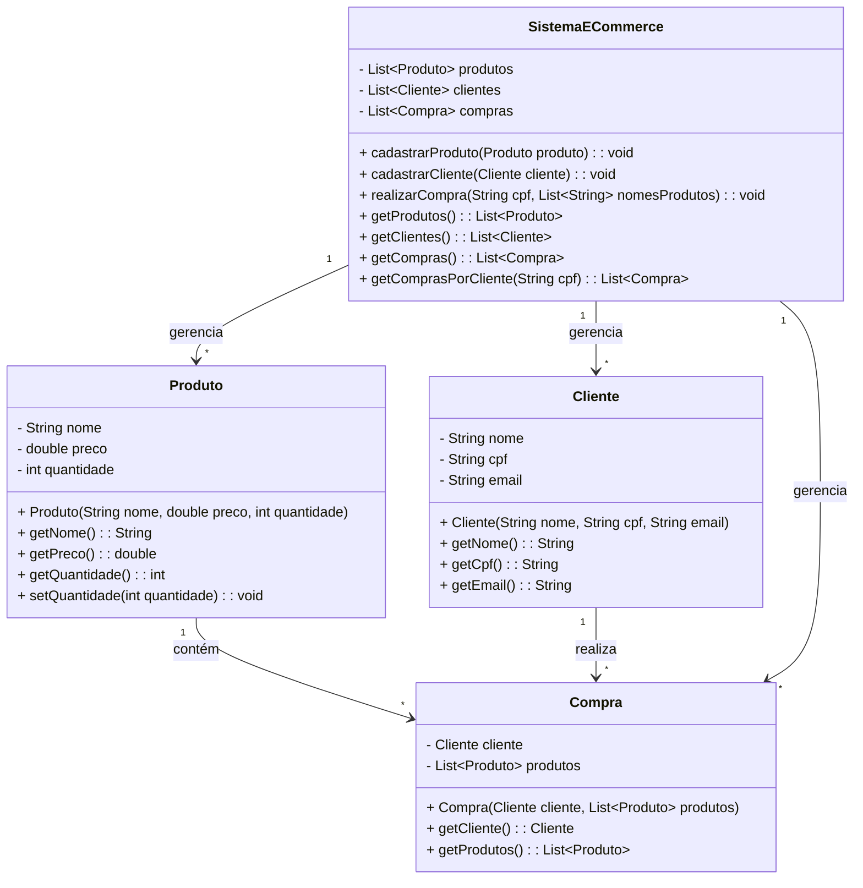

## Entrega Média

Adicionada a classe Compra para representar as compras realizadas.

O sistema agora gerencia compras e permite associar clientes e produtos às compras.

## Entrega Máxima

Expansão da funcionalidade de compras.

Adicionado o método getComprasPorCliente para consultar compras específicas de um cliente.

Regras de negócio como validação de estoque e redução de quantidade são implementadas no método realizarCompra.
